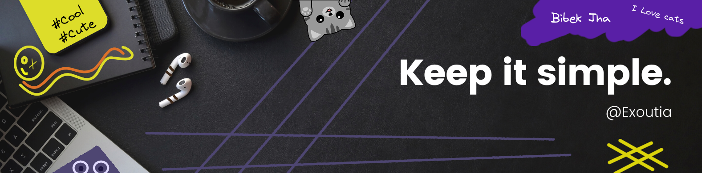

#  Hi, I’m @Exoutia

## **About Me 😊😊**

- 👀 I’m Proficient in Python and its different libraries.
- 😁 I am highly motivated guy and like to learn new things and try to solve them using many different methods.
- 🌱 I’m currently looking for a great project if you want to collaborate with me just ping me.
- 📖 I'm currently learning how to work with distributed system and deployments. 

## **My Skills 🚀**

<!-- this link below is where i got badges -->
<!-- https://github.com/alexandresanlim/Badges4-README.md-Profile -->

## **Connect with me at ✌😉**

 
 
 

## **My Workspace 💻**

  
My GitHub Stats:

  

  
My GitHub Streak:

  

  
My most used language:

  

  

    
  

  

    
  

